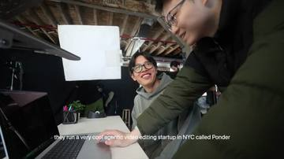
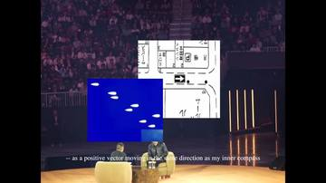
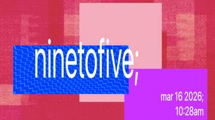
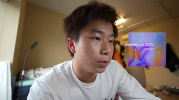
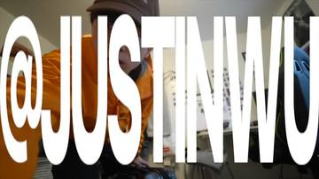
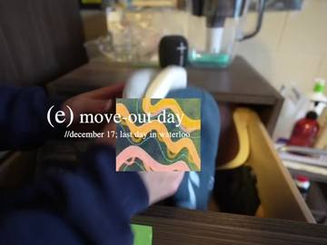

# byjustinwu: style guide

A study of three long video journals on @byjustinwu plus one launch short:

| id | video | length | uploaded |
|---|---|---|---|
| `iK5xtVEnSvU` | summer in uwaterloo engineering | 15:10 | Aug 2026 |
| `UhPZ4HeJQ6c` | first co-op term of uwaterloo engineering | 19:04 | May 2026 |
| `36ssmIOLffw` | first term of waterloo engineering | 18:33 | Dec 2025 |
| `phS28hhJSP8` | git for video editing (launch short) | 1:02 | Mar 2026 |

Evidence is written `video_id@seconds`. Every number here is in
`profile.json` with its confidence, and `study/analyze.py` recomputes it from
the extraction bundle. Pooled numbers use the three long videos. The short is
a different genre and only informs typography.

## In one paragraph

A diary, not a highlight reel. He opens by talking to the lens with no music,
stamps the date and time of day within the first 13 seconds, then lets music
carry b-roll while the story is told in **silent lowercase subtitles**, not
voice-over. Talk is unhurried: long takes, jump cuts, real pauses, and no
music underneath. Music comes back in blocks for montages that are mixed very
loud. Chapters are marked by a burst of pixel-glitch colour, a collage of
flat and warped rectangles, a run-together lowercase title ending in `;` or
`*`, and a two-line date stamp. The big moments get one full-frame,
vertically stretched all-caps slam. It ends on a brand card.

## Structure

1. **Cold open, no title.** Two of three open on him talking to camera
   (`iK5xtVEnSvU@0-100.6`, a 100-second dorm ramble; `UhPZ4HeJQ6c@0-9.8`, POV
   in the car). `36ssmIOLffw` opens on 12.8 s of music over him opening the
   blinds. Nothing ever opens on a title card.
2. **Date stamp in the first 13 s.** `iK5xtVEnSvU@3.4` "monday july 20th;
   noon", `UhPZ4HeJQ6c@9.76` "mar 7 2026; 6:32am", `36ssmIOLffw@12.8`
   "//december 08; morning". The stamp is the establishing shot.
3. **Brand in the open (2/3).** `UhPZ4HeJQ6c@0-3.3` a full-frame "@JUSTINWU"
   over his talking; `36ssmIOLffw@10-12` a small glitched "@BYJUSTINWU".
   The tagline "a video journal byjustinwu" lands at `36ssmIOLffw@16-20`.
4. **Chapters.** About 3 per 10 minutes, median 178 s long (16 chapters,
   85-358 s). YouTube chapter titles are lowercase (88%).
5. **Inside a chapter** the sections alternate: talking or vlog with live
   sound, then music-led b-roll or a montage.
6. **Reflective close.** One of: a voice-over monologue over a held bed
   (`iK5xtVEnSvU@832.6`, pillarboxed 4:3, serif captions), a party montage
   (`36ssmIOLffw@850`), or narrated b-roll (`UhPZ4HeJQ6c@1080`).
7. **End card, about 10 s.** Tagline over a quiet shot ("a summer experience
   byjustinwu." `iK5xtVEnSvU@904`), a wall of stacked "@JUSTINWU" with
   rectangles and "justinzwu.com" (`UhPZ4HeJQ6c@1134.7`), or a violet wash
   into flat orange (`36ssmIOLffw@1094`). Two of three finish with a 1.4-1.7 s
   **sting**: "@byjustinwu" centred on a flat field (blue `#2016b3` with a hard
   black offset shadow at `iK5xtVEnSvU@908.4`, orange caps on black at
   `36ssmIOLffw@1111.8`).

## Cut rhythm

Hard cuts at scene threshold 0.3. The thr 0.15 column also counts whip pans
and motion blur, so read it as how busy the picture feels.

| section | what it is | median shot | p10-p90 | cuts/min (0.3 / 0.15) |
|---|---|---|---|---|
| talking | to the lens, live sound | 12.9 s (5.4 s with jump cuts) | 1.6-51 s | 2.2 / 6.0 |
| confessional | Photo Booth webcam, `iK5xtVEnSvU@373.9-515.2` | 8.1 s | 2.1-51 s | 2.5 |
| vlog | handheld with friends | 8.3 s | 2.0-31.5 s | 3.9 / 12.2 |
| b-roll | music-led, often narrated | 3.7 s | 1.7-9.6 s | 10.1 / 19.5 |
| montage | music only | 2.75 s | 1.0-6.6 s | 15.3 / 37.3 |
| monologue | VO over bed | 3.4 s | 2.6-9.5 s | 11.2 |

- **Talk holds.** Longest single take 91.9 s (`UhPZ4HeJQ6c@371.8`), and
  53.8 s and 36.5 s holds in the night-drive chapter. Jump cuts come about
  3.7 a minute and alternate close / medium / wide framing
  (`iK5xtVEnSvU@28-38`). He keeps pauses: 4.1 silences of half a second or
  more per minute of talk, 16 a minute in the confessional.
- **Montage speed.** The fastest run is nine shots of 0.9-1.4 s
  (`36ssmIOLffw@476.6-485.7`, 8-shot median 1.1 s). `36ssmIOLffw` also has
  strobe bursts of 11-12 cuts in about 1.3 s (`@611.7`, `@616.2`).
- **Beats.** Montage cuts do not line up with loudness onsets any better than
  cuts shifted by 0.5-2 s (ratio 0.90, p 0.64-0.73 per video, stable across
  windows and thresholds). His masters are limited so hard that kicks barely
  register in the data, so this means "not detectable", not "off the beat".
  Treat beat lock as optional until the excerpt audio is checked.
- **Speech over cuts.** In the monologue 77% of cuts have speech on both
  sides: the VO runs straight through picture. In talking sections it is
  48%: about half the jump cuts land mid-phrase. True J/L offsets cannot be
  read from a mixed master.
- **Transitions** are hard cuts. None of the 426 shot-start frames shows a
  dissolve. The only soft joins are the glitch field before chapter cards and
  the `36ssmIOLffw` colour wash.

## Music and mix

- **Music plays in blocks between talk.** In `iK5xtVEnSvU` and `UhPZ4HeJQ6c`
  the pauses in on-camera talk measure -34 to -70 LUFS: room tone, no bed. In
  the confessional the pauses sit near -61. The one exception is
  `36ssmIOLffw@45-80`, where the previous track keeps playing under the lounge
  talk as a ducked bed.
- **The one duck we can measure** (`36ssmIOLffw@43.7`) falls from -6.5 to
  -21.3 LUFS, about 15 dB. It drops 0.69 s before the first word and finishes
  inside one 400 ms window. That is a keyframed pre-duck, not a compressor.
  Treat it as a single sample.
- **Monologue bed** sits flat about 10 LU under montage level (-20.2 LUFS in
  the word gaps against -10.1). It does not swell when the VO stops
  (`iK5xtVEnSvU@897.5-910`).
- **Levels by section** (median momentary): montage -8.0 LUFS (`36ssmIOLffw`
  runs -3 to -6), narrated b-roll -13.7, monologue -16.2, vlog -25.0,
  talking -29.8, confessional -36.8. Integrated -11.7 / -15.0 / -7.8 LUFS,
  true peak +1.4 / +1.5 / +2.3 dBTP.
- **Starts and stops.** Music comes in at the first b-roll after the opening
  talk (`UhPZ4HeJQ6c@9.76`, `iK5xtVEnSvU@100.6`), or from frame 0 when the
  open is b-roll. Ramps are short: median 1.0 s in and 1.65 s out, and a
  quarter of boundaries are hard (0.5 s or less). Tail fades run 0.6-1.4 s,
  except the 13 s orange wash.
- **Lyrics are fine.** The narration is silent text, so vocal tracks never
  fight it. The ASR transcribes lyrics under narrated b-roll
  (`iK5xtVEnSvU@127-142`).
- **Chapter cards are quiet.** They play over about -29 LUFS of room audio,
  with no music hit.

**Where the profile departs from the measurement:** `music.mix_targets`
puts talking at -18 LUFS rather than the measured -30, and true peak at
-1 dBTP rather than his overs. The contrast (talk clearly under montage) is
the style. Viewers riding the volume knob is not.

## Typography



**Narration captions** (`UhPZ4HeJQ6c@16-30`, `@846.9`, `36ssmIOLffw@403.9`,
`iK5xtVEnSvU@124-292`).
- Written narration, not transcription. The four lines read at
  `UhPZ4HeJQ6c@16-30` have no speech under them at all.
- Neutral sans (reads as SF Pro Text Regular), white, no box, no visible
  stroke.
- Bottom centre: text top at 0.850 H, baseline at 0.872 H. About 36 px at
  1080p.
- One line, never wrapped, up to about 60% of frame width (48-83 characters,
  median 71).
- Lowercase, but names and acronyms keep their case: "in NYC called Ponder".
- Each line holds about 4 s, back to back (12-21 characters per second). It
  can hold across a cut (`UhPZ4HeJQ6c@842.1 -> 846.9`).
- It never appears over on-camera talk (0 of 89 sampled frames) or over pure
  montage (0 of 21).



**Monologue captions** (`iK5xtVEnSvU@850-896`).
- A serif (reads as Times New Roman), smaller than narration (about 25 px at
  1080p), at the same baseline.
- Verbatim with the VO, lowercase. Continuation lines start with "-- ".

**Spoken captions** appear only on the skit in `phS28hhJSP8@4-22`: same sans
and position as narration, verbatim. The vlogs never caption on-camera talk.



**Chapter titles** (5 cards in `UhPZ4HeJQ6c`).
- Large sans (reads as SF Pro Display Regular), white, lowercase. X-height is
  about an eighth of the frame.
- Words run together: "ninetofive;", "summerlooweekone;", "nyc summer*",
  "film premiere;", "building vit". Four of five end in `;` or `*`.
- Titles hang over rectangle edges, and sizes can mix inside one title
  ("summer" about twice "looweekone;").
- An aside in asterisks sits beside one title: "\*three yrs in the making or
  sumn\*" (`@874.5`).



**Date stamps.**
- Two right-aligned lines in the narration sans, "mon d yyyy;" over
  "h:mmam".
- The newest video spells it out: "monday july 20th;" over "noon", and
  "thursday july 23rd; late evening".
- On full cards the stamp sits bottom-right about 0.06 H tall. As an inset
  over live footage (`iK5xtVEnSvU@4`, `@361.5`, `UhPZ4HeJQ6c@10`) it rides a
  pair of textured rectangles near the right edge.
- The engine fills stamps from clip creation time. There is one typo in the
  source ("mary 10 2026,"); do not reproduce it.



**Slam text: the distortion treatment.**
- Full-bleed ALL CAPS grotesque (Helvetica-like), **vertically stretched**:
  glyph height over advance is 4.1 on "@JUSTINWU" (`UhPZ4HeJQ6c@0`) and 3.3
  on the three-line "FOLLOWING YOUR INNER-COMPASS" (`iK5xtVEnSvU@852`).
- It fills 73-99% of the frame and bleeds off the edges.
- White over footage, red `#d40000` for the thesis line and the "WHAT ARE U"
  gag (`phS28hhJSP8@24`), or black on white for the end wall (1.7x stretch,
  three stacked rows).
- On screen 1-3 s. Used for the brand open, the video's thesis, and a
  punchline. At most one or two per video.
- The small end-sting wordmarks are the same idea, smaller: heavy condensed
  caps with a dark edge (`36ssmIOLffw@1105`), or lowercase with a hard black
  offset shadow (`iK5xtVEnSvU@908.4`).



**Serif section titles** (`36ssmIOLffw` only, Dec 2025).
- Lettered sub-sections in a serif: "(a) finals season" over
  "//december 08; morning", and "(e) move-out day" over
  "//december 17; last day in waterloo".
- Set over footage beside one textured rectangle.

**Tagline.** "a video journal byjustinwu" / "a summer experience
byjustinwu." in the narration sans, left edge at about 0.58 W, baseline at
0.757 H.

## The rectangle layer

The "contorted rectangles" are axis-aligned. No rectangle outline is rotated
or bent in any frame. What is contorted is the texture inside them. Anatomy
of a full chapter card (`UhPZ4HeJQ6c@172.8, 366.1, 464.5, 874.5, 1074.5`):

- **Field.** A full-frame macroblock / pixel-sort glitch in one hue family,
  animated. It plays alone for 0.33-1.09 s (median 0.67 s) before the card
  elements pop on.
- **Rectangles.** Three or four, 25-50% of the width and 20-45% of the
  height, each overlapping another by roughly 15-40%. About half are flat
  fills and half are textures.
  - Flat fills: `#ffa9ff`, `#c436ac`, `#f3acbc`, `#ca32ff`, `#63b591`,
    `#434343`, `#512f48`.
  - Textures: zigzag op-art, wavy stripes, liquid ripple, topographic
    contours, pixel sort, fire macro.
  - Each card keeps to one hue family: green+pink, crimson+pink+violet,
    violet+teal+magenta, chartreuse+pink+sky, periwinkle+plum+gold.
- **Timing.** Every card holds exactly 5.714 s (137 frames at 23.976) after
  the lead-in, 6.4 s in total. The identical length says this is a saved
  template.
- **Motion.** Rectangles and text do not move while the card holds
  (172.839 = 173.006 = 176.510). They leave in a stagger: one is gone by
  370.7, and a stripe rectangle is still over the first live frame at 178.553.
- **Inset variant** (`iK5xtVEnSvU@3.4`, `@361.5`, `UhPZ4HeJQ6c@9.8`). Two
  rectangles about a quarter of the width, over live footage, carrying the
  date stamp for 3-6 s. The textures here are a holographic gradient, white
  blobs on royal blue, a perspective checkerboard, and a Japanese street-map
  print.
- **Other uses of the same vocabulary.**
  - The map-print and blue-blob rectangles float over the monologue
    (`iK5xtVEnSvU@882`).
  - A coarse pixel-mosaic rectangle hides a bystander (`36ssmIOLffw@403.9`).
  - A flat orange frame `#ec4302` marks the 'all systems go' chapter
    (`36ssmIOLffw@795.0`) and returns as the final wash.

## Other signatures

- **Mixed formats, pillarboxed.** 4:3 clips sit on the 16:9 timeline in black
  bars (`iK5xtVEnSvU@212-296`, and the whole monologue). They are never
  cropped. Cut Conductor's colour pass flags that aspect mismatch; for this
  style the mismatch is intended.
- **Ultrawide POV** with the lens distortion left in, in every vlog.
- **Screen as set.** The confessional is a Photo Booth window screen-recorded
  on a white desktop, with icons and the volume HUD left in
  (`iK5xtVEnSvU@373.9`).
- **How it changed over time.** Dec 2025 used serif lettered sections, a bed
  under talk, and a 4:3 master. May 2026 moved to full glitch chapter cards
  with no bed under talk. Aug 2026 uses inset stamps, 16:9 with 4:3 inserts,
  and a serif monologue close. The profile's priors lean toward the 2026
  videos.

## How jevid uses this

`profile.json` is in the assembly engine's `jevid.style` schema (v1). It
extends `base` and overrides only what differs. The engine reads it as-is.

- **Engine section kinds pool the finer labels.**
  - talking = talking + confessional + vlog.
  - montage = music-only montage + music-led b-roll.
  - intro = the cold open.
  - outro = the last section before the end card.

  The finer split sits beside the engine keys (`pacing.talking.parts`,
  `pacing.montage.fast`, `pacing.montage.broll`).
- **Music blocks are clip-gain beds.** Talking and a talk-led intro sit at
  -96 dB, montage -2, title cards -16, end card -9, relative to montage at
  full level. Variants the engine can switch to sit next to each bed:
  `when_bed`, `when_music_broll`, `when_monologue`.
- **Speech is not captioned** (`typography.subtitle.enabled: false`). The
  subtitle geometry is still his, for narration or a skit. Narration text,
  chapter titles, asides and the tagline noun come from Justin. Jev and Opus
  only select; they never write.
- **Evidence** for every value is in `provenance.evidence`, keyed by dotted
  path, with a confidence and an optional `measured` pointer into
  `study/measured.json`. `adjusted` marks a deliberate departure from the
  measurement.
- **Additions** are listed in `provenance.additions`. Nested ones are kept
  silently by the loader. The top-level `decisions` list draws one "kept but
  not read" warning.
- **`decisions`** are the runtime calls, each with an `editorial` flag for
  `conductor.jev.ask`.
  - Linear calls go to Jev (`editorial: false`): which role a run of clips
    plays, whether a talking section keeps a bed, whether a montage locks to
    the beat, whether a pause stays.
  - Creative calls go to Opus 5.5 (`editorial: true`): how the video opens,
    how chapters are marked, which line earns a slam, how it closes.

## What the data could not answer

- **Exact typefaces and weights.** SF Pro Text / Display, Times New Roman and
  Helvetica are visual matches at 640 px. Title-effect names, tracking, and
  any shadow need his Final Cut project or Motion templates.
- **Text and rectangle animation curves.** Stills show pop-on, static hold,
  and staggered exit. Easing, fades under a frame, glitch-field animation
  speed, and any scale or position keyframes need the 90 s excerpts or the
  project.
- **Texture sources.** The rectangle textures and glitch fields are assets
  (a pack, or his own renders). The engine needs them supplied.
- **Beat alignment.** The bundle's loudness is too coarse for a heavily
  limited master. The audio in the excerpts, or the project's markers,
  would settle it.
- **J/L cuts and duck keyframes.** Only a mixed stereo master was analysed.
  Real audio-lead/lag and duck curves need separate tracks. The duck numbers
  come from one event.
- **Music selection.** Genre, tempo and the licensing source of tracks are
  unknown. Tempo estimates from loudness autocorrelation (60-150 BPM) are
  unreliable and are not used.
- **Caption timing precision.** Durations come from 2 s frame spacing, so
  each is ±2 s. The narration text itself is his writing and cannot be
  derived.
- **Colour grade.** Nothing beyond "natural, bright, wide lens" can be said
  from YouTube-compressed frames. The colour pass is review-only anyway.
- **Why dialogue is so quiet.** It may be deliberate intimacy or unnormalised
  camera audio. The profile narrows the gap and says so.

## Reproduce

```bash
pip install numpy pillow        # pillow only for the frame-derived numbers
python styles/byjustinwu/study/analyze.py --bundle /path/to/unzipped/bundle \
  --out styles/byjustinwu/study/measured.json
python -m pytest tests/test_byjustinwu_profile.py
```

`study/sections.json` holds the only hand-made input: section labels per
time range, card timings, and which frames to measure. Change a label and
rerun. The test fails if a profile value drifts from its measurement
without an `adjusted` note, or if any value lacks evidence.
